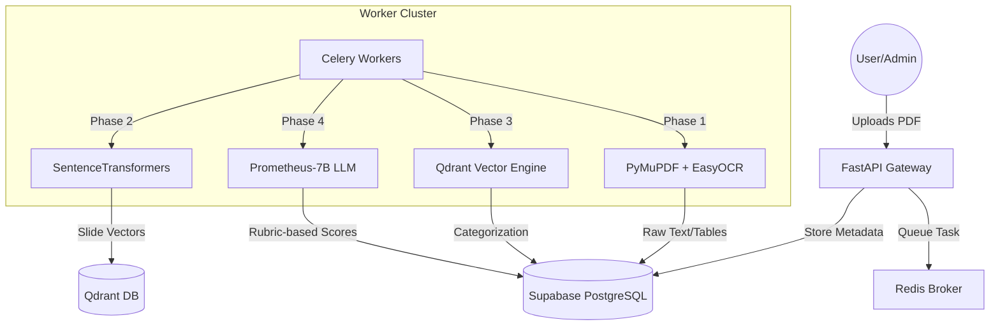

# HackEval 🚀
### Intelligent Hackathon Submission Evaluation & Management System

HackEval is a high-performance, asynchronous pipeline designed to automate the grueling task of evaluating hackathon submissions. By leveraging multi-stage AI processing, it extracts, vectorizes, categorizes, and grades PDF submissions with professional-grade precision.

---

## 🏛️ System Architecture

---

## ⚙️ The Backend Engine: A 4-Phase Pipeline

### Phase 1: Intelligent Extraction
Unlike simple text scrapers, HackEval uses a hybrid strategy:
- **Primary Engine**: `PyMuPDF` (fitz) for ultra-fast native text and table extraction.
- **Fallback Engine**: `EasyOCR` rendered via PIL for image-only slides or complex graphic layouts.
- **Output**: Structured markdown for tables, raw text for content, and complexity scores.

### Phase 2: Semantic Vectorization
We transform human language into mathematical meaning:
- **Model**: `all-MiniLM-L6-v2` (SentenceTransformers).
- **Process**: Each slide is embedded into a 384-dimensional vector space.
- **Storage**: Vectors are indexed in **Qdrant** with HNSW indexing for sub-millisecond retrieval.

### Phase 3: Auto-Categorization
The system automatically maps submissions to the correct "Problem Statement":
- **Algorithm**: Cosine Similarity.
- **Logic**: We calculate the centroid of a submission's slide vectors and compare it against the vectors of all project tracks. 
- **Confidence**: Submissions below a specific threshold are marked for manual review or "Open Innovation".

### Phase 4: AI-Driven Evaluation (The Judge)
The final stage uses a specialized LLM to grade submissions against custom rubrics:
- **Model**: `Prometheus-7B v2.0` (A SOTA evaluator model).
- **Inference**: Hosted on a remote **vLLM** instance for high-throughput batch grading.
- **Logic**: The judge analyzes the extracted content, cross-references it with the problem statement, and provides detailed feedback + an integer score (1-5).

---

## 🖥️ Infrastructure & AWS Deployment

To run HackEval at scale, we recommend the following AWS configuration:

| Component | Role | AWS Instance | Rationale |
| :--- | :--- | :--- | :--- |
| **App Gateway** | FastAPI, Redis, Auth | `t3.large` | Burst-capable CPU for high API concurrency. |
| **Worker Node** | PDF Parsing & Embedding | `g4dn.xlarge` | NVIDIA T4 GPU accelerates OCR and SentenceTransformer batching. |
| **Vector DB** | Qdrant | `m5.large` | Optimized for memory-intensive HNSW indexing. |
| **AI Judge** | Prometheus-7B (vLLM) | **`g5.xlarge`** | 24GB A10G VRAM is required to serve the 7B model via vLLM with low latency. |

> [!NOTE]
> The current system is configured to connect to a production vLLM instance at `http://3.110.43.22:8000/v1`.

---

## 🛠️ Technology Stack

- **Framework**: FastAPI (Asynchronous Python)
- **Task Queue**: Celery + Redis
- **Database**: Supabase (PostgreSQL + Real-time)
- **Vector Search**: Qdrant
- **ML/AI**:
  - `SentenceTransformers` (Embeddings)
  - `Prometheus-7B` (Evaluation)
  - `Docling` / `PyMuPDF` (Extraction)
- **Frontend**: React (Modern Dark-Mode UI)

---
